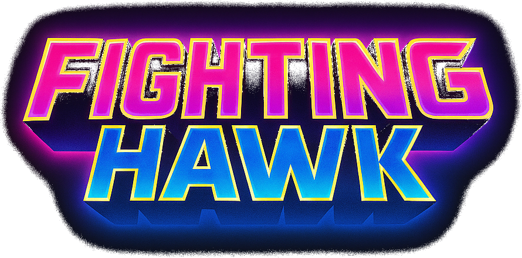

<div align="center">



# 🚀 Fightinghawk

Arcade shoot 'em up web/mobile construido con Ionic, Angular y Phaser.

</div>

---

## 📌 Descripción

`Fightinghawk` es un proyecto académico que integra una app hecha con **Ionic + Angular** y una escena jugable desarrollada en **Phaser 3**.

Según el código actual del repositorio, la aplicación permite:

- ingresar un nombre de jugador y guardarlo en `localStorage`;
- iniciar una partida arcade 2D con nave, enemigos, disparos, explosiones y HUD;
- controlar la nave con `flechas`, disparar con `espacio`, pausar con `P` y reanudar con `R`;
- mostrar una pantalla de `Game Over` y consultar un ranking con el top 5 de puntajes.

---

## 🎮 Dinámica del juego

### 🏁 Objetivo
Sobrevivir el mayor tiempo posible, destruir enemigos y sumar puntos antes de perder todas las vidas.

### ⌨️ Controles

<p align="center">

• `Flechas` → movimiento de la nave  
• `Espacio` → disparo principal  
• `P` → pausa de la partida  
• `R` → reanudar partida pausada

</p>

### 🔁 Flujo actual

<p align="center">

• ***[Inicio]*** El jugador ingresa su nombre desde la pantalla principal.  
• ***[Partida]*** Se monta la escena de Phaser con HUD, enemigos, disparos y scroll de fondo.  
• ***[Combate]*** El puntaje sube al destruir enemigos y las vidas bajan al recibir impactos.  
• ***[Cierre]*** Al quedarse sin vidas, se muestra `Game Over` y el puntaje puede quedar reflejado en el ranking local.

</p>

---

## 🏛 Estructura resumida

### 🧭 Navegación y páginas
- `src/app/pages/home/` -> menú principal, ingreso de nombre y accesos a juego o scores.
- `src/app/pages/game/` -> página Angular/Ionic que monta el juego de Phaser.
- `src/app/pages/scores/` -> listado de mejores puntajes guardados en `localStorage`.
- `src/app/app.routes.ts` -> rutas `home`, `game` y `scores`.

### 🎮 Lógica Phaser
- `src/app/phaser/scenes/game.scene.ts` -> escena principal, preload de assets, colisiones, score y pausa.
- `src/app/phaser/scenes/game-over.scene.ts` -> pantalla de fin de partida con retry y vuelta al menú.
- `src/app/phaser/controller/player-manager.ts` -> movimiento del jugador y disparo.
- `src/app/phaser/controller/enemy-manager.ts` -> aparición y manejo de enemigos.
- `src/app/phaser/controller/bullet-manager.ts` -> balas del jugador y enemigas.
- `src/app/phaser/controller/explosion-manager.ts` -> efectos de explosión.

### 🧩 UI, assets y configuración
- `src/app/phaser/ui/` -> HUD de vidas, score, nivel y pausa.
- `src/assets/` -> sprites, fondos e imágenes del juego.
- `angular.json` -> salida web en `www` y configuración principal de Angular.
- `capacitor.config.ts` -> integración base con Capacitor usando `webDir: 'www'`.

---

## ✅ Requisitos previos

- `Node.js`
- `npm`

No hay una versión de Node fijada en `package.json`, así que conviene usar una versión compatible con **Angular 19**.

---

## ⚙️ Instalación y ejecución

```bash
npm install
npm start
```

`npm start` ejecuta `ng serve` para levantar el entorno de desarrollo.

### 📜 Scripts disponibles

- `npm start` -> levanta el entorno de desarrollo.
- `npm run build` -> genera la build web con Angular.
- `npm run watch` -> compila en modo desarrollo con watch.
- `npm test` -> ejecuta tests con Karma/Jasmine.
- `npm run lint` -> corre ESLint.

---

## 🛠 Tecnologías y herramientas

<div align="center">
  
  
  
  
  
  
  
  
</div>

---

<table align="center">
  <tr>
    <td align="center">
      <a href="https://github.com/LeanEmanuel">
        
      </a>
      <br />
      <a href="https://github.com/LeanEmanuel">
        
      </a>
    </td>
  </tr>
</table>
